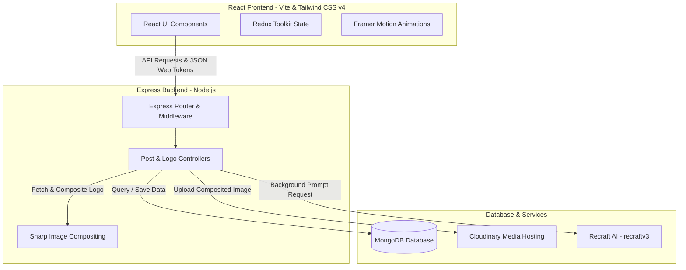

# 🚀 AdWhiz — AI-Powered Marketing Automation

AdWhiz is a local-first, AI-driven marketing automation platform that simplifies the process of creating professional, branded social media posts and advertisements. By leveraging advanced generative AI and automated server-side image processing, AdWhiz allows businesses to generate high-quality visual content with their logos seamlessly embedded in seconds.

---

## 🏗️ System Architecture

AdWhiz uses a monorepo architecture with a decoupled client and server:



* **Frontend**: Responsive React 19 single-page application built on Vite, styled with Tailwind CSS v4, managed using Redux Toolkit, and animated using Framer Motion.
* **Backend**: Express REST API handling authentication (local and Google OAuth), file upload parsing, and business logic coordination.
* **Storage & Hosting**: Cloudinary holds all brand logos and final generated ad assets, while MongoDB maintains state for users, logos, and posts.
* **AI & Processing**: Recraft AI (`recraftv3` model) generates realistic background scenes, and the **Sharp** library handles pixel-perfect logo scaling and compositing on the server.

---

## ✨ Features

* **Brand Identity Profiles**: Save your business name, sector, and company logo. Logos are automatically parsed and optimized via Cloudinary.
* **AI-Powered Banner Generation**: Enter a prompt or select a predefined style/tone. The system creates realistic image backdrops tailored to your business sector.
* **Automated Compositing**: Automatically embeds the company logo as a watermark at the optimal position (resized to 20% of the banner's width) using the Sharp library.
* **Personal Workspace**: View and manage all generated posts:
  * **Favorite / Archive**: Toggle posts as favorites for quick access.
  * **One-Click Download**: Directly download high-resolution composite images.
  * **Regeneration**: Tweak prompts, tones, or sizes and regenerate instantly while keeping the brand context.

---

## 🛠️ Tech Stack

* **Frontend**: React 19, Vite, Tailwind CSS v4, Redux Toolkit, Framer Motion, Axios, React Select, React Toastify.
* **Backend**: Node.js, Express, Mongoose (MongoDB), Sharp, Multer, Axios, JsonWebToken, Nodemailer.
* **Third-Party APIs**: Cloudinary (Image Hosting), Recraft AI (Generative Imagery), Google OAuth 2.0 (Identity).

---

## 📁 Repository Structure

```text
adwhiz/
├── client/                 # React Frontend (Vite)
│   ├── src/
│   │   ├── components/     # Reusable UI elements (SideBar, NavBar, Modals)
│   │   ├── pages/          # Page components (Home, Login, Signup, GeneratedContent)
│   │   ├── hooks/          # Custom hooks (e.g. useScreenSize)
│   │   └── App.jsx         # App router and layout
│   ├── package.json
│   └── vite.config.js
├── server/                 # Express Backend (Node.js)
│   ├── config/             # DB Connection Config
│   ├── controllers/        # Express Controllers (Post, Logo, User)
│   ├── middleware/         # Auth & Multer file upload handlers
│   ├── models/             # Mongoose Schemas (User, Logo, Post)
│   ├── routes/             # REST Endpoints
│   ├── server.js           # Server Entry Point
│   └── package.json
└── Project Overview.md     # General project overview
```

---

## ⚙️ Local Setup & Configuration

### Prerequisites
* **Node.js** (v18 or higher)
* **npm** (v9 or higher)
* **MongoDB** (running locally on `mongodb://localhost:27017` or Atlas URI)

### 1. Clone the Repository
```bash
git clone https://github.com/ShaileshLambode/adwhiz.git
cd adwhiz
```

### 2. Configure Environment Variables
Create a `.env` file in the `server` directory:
```bash
cd server
cp .env.example .env
```
Fill in the following variables in `server/.env`:
```properties
PORT=4000
MONGO_URI=mongodb://localhost:27017/adwhiz
JWT_SECRET=your_jwt_secret_here

# Cloudinary Credentials
CLOUDINARY_CLOUD_NAME=your_cloud_name
CLOUDINARY_API_KEY=your_api_key
CLOUDINARY_API_SECRET=your_api_secret

# AI API Keys
RECRAFT_API_KEY=your_recraft_api_key_here
OPENAI_API_KEY=your_openai_api_key_here
```

Create a `.env` file in the `client` directory:
```bash
cd ../client
cp .env.example .env
```
Configure your client API variables:
```properties
VITE_BACKEND_URL=http://localhost:4000
VITE_GOOGLE_CLIENT_ID=your_google_client_id_here
```

### 3. Install Dependencies & Run
Start the backend server:
```bash
cd ../server
npm install
npm run dev
```
The server will start at `http://localhost:4000`.

Start the frontend client:
```bash
cd ../client
npm install
npm run dev
```
The client will start at `http://localhost:5173`. Open this URL in your web browser.

---

## 🔌 API Reference Summary

| Endpoint | Method | Authentication | Description |
| :--- | :--- | :--- | :--- |
| `/api/user/signup` | `POST` | Public | Register a new user |
| `/api/user/login` | `POST` | Public | Standard login with email/password |
| `/api/logo/add` | `POST` | JWT Required | Upload business logo and metadata |
| `/api/logo/list` | `GET` | JWT Required | Get all business profiles for the user |
| `/api/post/create` | `POST` | JWT Required | Generate ad scene via Recraft and composite logo |
| `/api/post/listpost` | `GET` | JWT Required | Retrieve generated post history |
| `/api/post/download/:id` | `GET` | JWT Required | Download the final composite image |
| `/api/post/favoritetoggle/:id` | `PATCH` | JWT Required | Favorite/unfavorite a post |

---

## 📝 License

Distributed under the ISC License. See `LICENSE` for more information.
