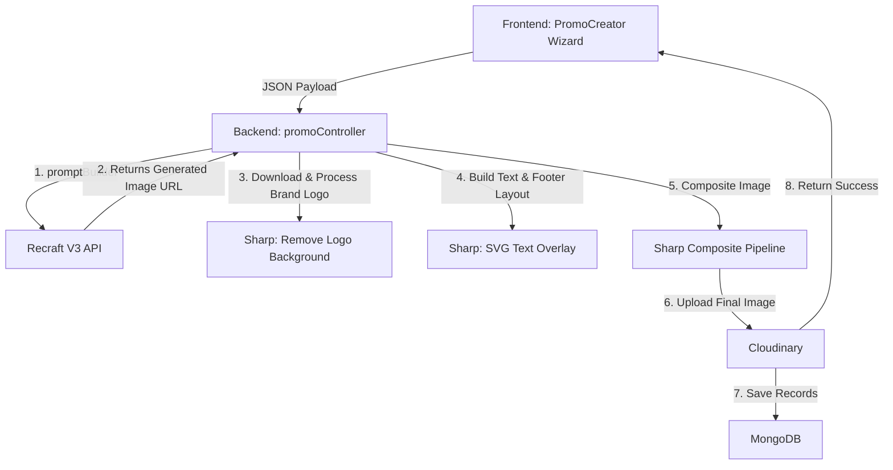

# AdWhiz Poster Creation System Documentation

This document explains the architecture, design patterns, rendering pipeline, and constraints of the **AdWhiz Festival & Promotional Poster Creator** feature.

---

## 🏗️ System Architecture

The poster creator operates as a hybrid generation system. It combines **generative AI (Recraft V3)** for producing high-quality graphic backdrops and aligned headline text with **server-side programmatic canvas & compositing engines (Sharp, Canvas)** for rendering complex paragraphs, brand badges, and contact details.

---

## 🎨 Rendering Pipeline

To deliver a premium, high-fidelity ad flyer (like the `LOREM` design standard), the system divides the rendering duties between AI generation and programmatic SVG overlays:

| Component | Responsibility | Technical Implementation |
|---|---|---|
| **Background Backdrop** | Renders festive artwork, illustrations, and gradients. Pushed to the right half of the canvas. | Recraft V3 API (`digital_illustration` preset) |
| **Headline / Display Text** | Renders stylized hero text (e.g., "HAPPY DIWALI") aligned inside specified regions. | Recraft V3 `text_layout` parameter (AI-rendered characters) |
| **Left Panel Backing** | Semi-transparent solid screen covering the text panel to ensure high-contrast readability. | SVG `<rect>` composite overlay via Sharp |
| **Brand Logo Badge** | Crisp white rounded card container centering the company logo in the top-left corner. | SVG `<rect>` + Sharp image compositing |
| **Tagline, Body, & Footer** | Renders taglines, promotional body copy paragraphs, and call-to-actions. | Sharp SVG `<text>` overlay (auto-wrapped) |
| **Contact Strip** | Dark bar at the bottom containing `website | email` contact strings. | SVG `<rect>` + `<text>` composite overlay |

---

## 📝 Recraft V3 API Constraints

Recraft V3's `text_layout` parameter is designed specifically for short display text (e.g. signage, headlines). It has strict validation rules:

1. **One Word per Entry**: The layout list only accepts individual words. Multi-word strings (like `"HAPPY DIWALI"`) must be programmatically split.
2. **Word Width Allocation**: To render multiple words on a single line, the system divides the template slot's width by the number of words, dynamically computing separate bounding box polygons for each word.
3. **Uppercase Characters Only**: The API character set is limited. All input characters are converted to uppercase, and unsupported characters (like lowercase letters or custom symbols) are cleaned.
4. **Signage Limit**: Any long sentence or body copy paragraph cannot be sent to `text_layout` (as tiny word bounding boxes fail to render). These are filtered out and rendered programmatically on the server.
5. **Top-Level Parameter**: The `text_layout` parameter must be placed at the root level of the Recraft API payload (not nested inside `controls`).

---

## 📂 File Structure & Responsibilities

### 1. Database Layer
* **`server/models/ImageTemplate.js`**: Schema for festival occasion templates. Stores names, aspect ratios, color palettes, and text slots defined in `{ x, y, width, height }` dimensions.
* **`server/models/PromoPost.js`**: Schema mapping user IDs, brand logo profiles, used templates, input parameters, and generated Cloudinary URLs.

### 2. Backend Logic Layer
* **`server/utils/promptBuilder.js`**: 
  * `buildPrompt()`: Generates flat 2D graphic design prompt instructions, ensuring the model keeps the left side clear for text overlays and renders illustrations on the right.
  * `buildTextLayoutEntries()`: Splits the display headline into uppercase, single-word entries with relative 4-point polygon bboxes.
  * `hexToRgb()`: Formats hex color lists into `{ rgb: [r, g, b] }` arrays for Recraft color control blocks.
* **`server/controllers/promoController.js`**:
  * Orchestrates the Recraft API call, background removal from the logo, SVG text wrapping, canvas footer composition, image stacking, and Cloudinary uploads.
* **`server/routes/promoRoutes.js`**: Route definitions mapping endpoints for template listing, generation, favorites, deletions, and authenticated downloads.

### 3. Frontend Wizard Layer
* **`client/src/pages/PromoCreator.jsx`**: A 5-step guided form taking users through Template selection, Brand Profile selection, text overrides, dimensions/style presets, and generation preview.
* **`client/src/pages/PromoGallery.jsx`**: Responsive grid showing all generated promotional content, handling download file Blobs (with JWT authorization headers), deletion requests, and favorite status changes.
