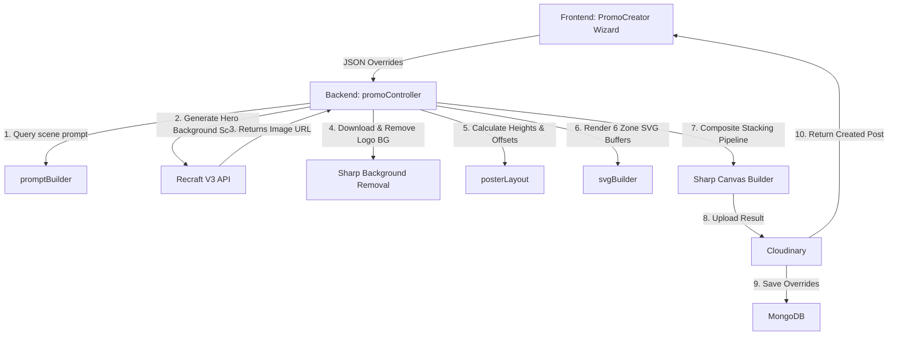

# AdWhiz Poster Creation System Documentation

This document explains the architecture, design patterns, rendering pipeline, and file structure of the **AdWhiz Multi-Zone Infographic Poster Creator** feature.

---

## 🏗️ System Architecture

The poster creator is a **hybrid rendering system** designed to construct professional, high-fidelity promotional flyers resembling the `LOREM` design standard. It combines **generative AI (Recraft V3)** for producing a high-quality, textless festive scene backdrop with **programmatic server-side SVG rendering (Sharp)** to overlay pixel-perfect, branded content.



---

## 🎨 Layout Zones (Top to Bottom)

The flyer canvas (W×H) is divided into 6 distinct, contiguous vertical layout zones:

```
┌─────────────────────────────────────────────────────────────┐
│  ZONE 1 — HEADER BAR (10% Height)                           │
│  [Logo Image]       [Tagline Slogan]      [🌐 Website  ✉ Email]│
├──────────────────────────┬──────────────────────────────────┤
│  ZONE 2 — HERO TEXT      │  ZONE 2R — FESTIVE IMAGE         │
│  (42% Height)            │  (Recraft backdrop crop)         │
│  • Headline              ├──────────────────────────────────┤
│  • Subheading            │  ZONE 2R — QUOTE BOX OVERLAY     │
│  • Body message          │  • Decorative border frame       │
│  • Slogan                │  • Small top icon + custom quote │
├──────────────────────────┴──────────────────────────────────┤
│  ZONE 3 — VALUES ROW (10% Height)                           │
│  Circle border icon + bold label + description (3 columns)  │
├─────────────────────────────────────────────────────────────┤
│  ZONE 4 — MARKETING FEATURES BAR (8% Height)                │
│  4 features columns: [Icon header] + [Short description]    │
├─────────────────────────────────────────────────────────────┤
│  ZONE 5 — PRODUCT SHOWCASE ROW (10% Height)                 │
│  Customizable row showing product emojis + category names   │
├─────────────────────────────────────────────────────────────┤
│  ZONE 6 — FOOTER STRIP (10% - 12% Height)                   │
│  Dark background, 4 columns: [Icon] + text lines + gold highlight│
└─────────────────────────────────────────────────────────────┘
```

| Zone | Responsibility | Implementation Details |
|---|---|---|
| **Zone 1: Header** | Brand identification and contact details. | White background, left aligned brand logo, center tagline, right-aligned parsed business contact info. |
| **Zone 2: Hero Left** | Main occasion branding and text copy. | Dark semi-transparent (Holi, Diwali) or solid cream (Bhai Dooj) text panel with headline, tagline, and slogans. |
| **Zone 2 Right** | Visual background scenery. | Recraft V3 flat digital illustration (`digital_illustration` preset) cropped and resized to fill the right half. |
| **Zone 2 Right Box** | Slogan card overlay. | A white, rounded translucent overlay card with double dashed borders and centered quote lines. |
| **Zone 3: Values Row** | Highlight core company values (Enjoy, Love, Celebrate). | 3 columns separated by light vertical rules, containing circled emojis, uppercase labels, and descriptions. |
| **Zone 4: Features Bar** | Reassure brand features (Made in India, Premium, etc.). | 4 columns, separated by vertical dividers, showing icons and uppercase text lines. |
| **Zone 5: Product Row** | Showcase available product categories. | Horizontal row of product category icons (backpacks, wallets, belts, folders) with bold subtexts. |
| **Zone 6: Footer Strip** | Final brand slogan and columns. | Dark-colored footer divided into 4 columns with brand details and gold highlighted sentences. |

---

## 📝 Text Rendering & Font Constraints

All text layout coordinates are programmatically composited via server-side SVGs to ensure crisp, clean presentation.

1. **Font Uniformity**: To guarantee platform consistency across development, staging, and production environments, all text overlays default to `Arial, sans-serif` supported natively by `librsvg`.
2. **Dynamic Text Wrapping**: Input paragraphs (body messages, quote boxes, footer lines) are programmatically split into lines using custom `wrapText` logic before rendering to prevent horizontal overflows.
3. **No Recraft `text_layout` Dependency**: Display typography is entirely built programmatically on the server, removing reliance on Recraft's signage features. This ensures spelling accuracy and allows the use of lowercase text.

---

## 📂 File Structure & Responsibilities

### 1. Database Layer
* **[ImageTemplate.js](file:///c:/Users/1/AiMaven/adwhiz/adwhiz/server/models/ImageTemplate.js)**: Holds the predefined layout defaults (Hero Content, Values array, Product Showcase defaults, and Footer details) for each festival.
* **[PromoPost.js](file:///c:/Users/1/AiMaven/adwhiz/adwhiz/server/models/PromoPost.js)**: Stores generated poster information along with `userOverrides` containing the exact configurations typed by the user.

### 2. Rendering Utilities
* **[svgBuilder.js](file:///c:/Users/1/AiMaven/adwhiz/adwhiz/server/utils/svgBuilder.js)**: Programmatic builders for all 6 layout SVGs. Implements margins, dividers, borders, icons, text wrapping, and color fills.
* **[posterLayout.js](file:///c:/Users/1/AiMaven/adwhiz/adwhiz/server/utils/posterLayout.js)**: Resolves final poster dimensions and computes proportional pixel height partitions for each vertical zone.
* **[promptBuilder.js](file:///c:/Users/1/AiMaven/adwhiz/adwhiz/server/utils/promptBuilder.js)**: Forms background-scene illustration instructions for Recraft, filtering out any instructions related to text, banners, or humans.

### 3. Server Controller
* **[promoController.js](file:///c:/Users/1/AiMaven/adwhiz/adwhiz/server/controllers/promoController.js)**: Links the overall pipeline:
  * Generates the backdrop via Recraft.
  * Downloads and removes backgrounds from brand logos.
  * Runs the layout height resolver.
  * Creates and overlays the SVG zones sequentially.
  * Streams the final composited JPEG to Cloudinary.

### 4. Client Pages
* **[PromoCreator.jsx](file:///c:/Users/1/AiMaven/adwhiz/adwhiz/client/src/pages/PromoCreator.jsx)**: 5-step wizard presenting users with visual template categories, logo selection, tabbed zone text input sheets, and size/style configurations.
* **[PromoGallery.jsx](file:///c:/Users/1/AiMaven/adwhiz/adwhiz/client/src/pages/PromoGallery.jsx)**: User workspace gallery for viewing, deleting, favoriting, and exporting generated posters.
